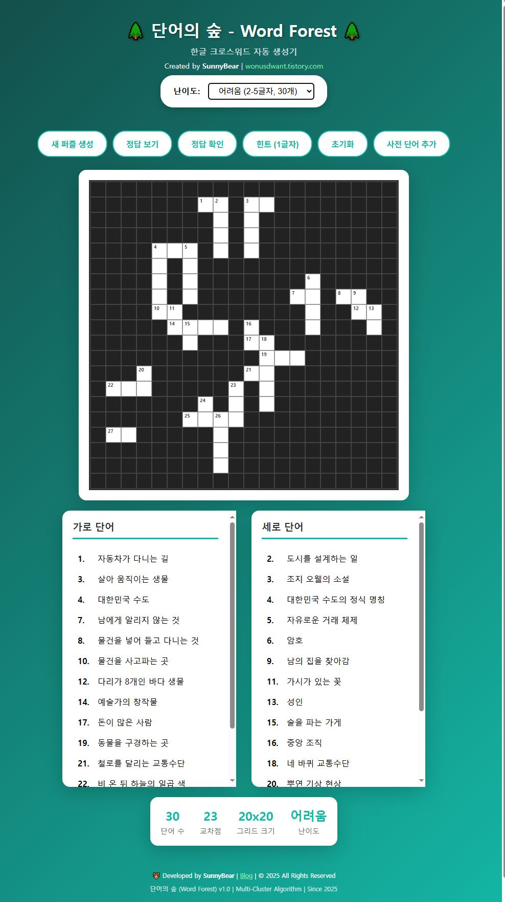

# 단어의 숲 - 한글 크로스워드 퍼즐 생성기

<div align="center">

</div>

한글 기반의 크로스워드 퍼즐을 자동으로 생성하는 웹 애플리케이션입니다.

## 실행 방법

### 필수 요구사항
- Node.js

### 설치 및 실행

1. 의존성 설치:
   ```bash
   npm install
   ```

2. 앱 실행:
   ```bash
   npm run dev
   ```

3. 브라우저에서 `http://localhost:3000` 접속

## 주요 기능

- 한글 단어 기반 크로스워드 퍼즐 자동 생성
- 다양한 난이도 레벨 지원
- 힌트 시스템
- 인터랙티브한 게임 플레이
